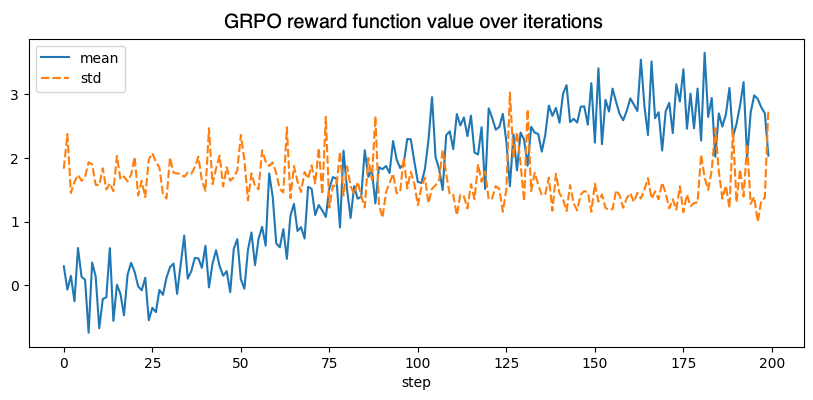

# Fune-tune model for positive reviews generation

- Trained a [sentiment classifier](./train_reward_function.ipynb).
- Used it as a reward function to [fine-tune](./fine_tune.ipynb) an LLM using GRPO.

### Notes

- I used 🤗 [google/embeddinggemma-300m](https://huggingface.co/google/embeddinggemma-300m) as a base model for sentiment classification.
- With a 2-layer MLP head, it achieved `ROC_AUC_SCORE=0.985` on 🤗 [imdb](https://huggingface.co/datasets/stanfordnlp/imdb) reviews dataset.
- At first I tried to use BERT for sentiment classification, but neither PPO nor GRPO worked. The LLM just wouldn't generate positive reviews. After a few hours I realized that `learning_rate=1.41e-5` is too low, and after `max_steps=400` with `batch_size=64`, LoRA adapters were still barely alive.
- Setting `learning_rate=5e-4` led to a funny overfitting, e.g. ["touching and truly touching movie"](output/touching_and_truly_touching.txt).
- Finally, I was able to choose the right `learning_rate=1e-4` and `max_steps=200`, and it finally started to write [positive reviews](output/pleasure_to_watch.txt).

